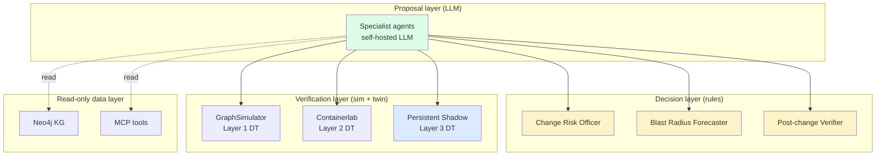

# For chief architects

The questions every architect asks within the first 5 minutes:

1. **"How does it scale?"** → [scalability-v3.md](scalability-v3.md). V3 persistent shadow on a dedicated host. ~$1.54/hr, ~$0.006 per incident.
2. **"Multi-vendor or single-vendor?"** → [vendor-abstraction.md](vendor-abstraction.md). 4 plugin types, ~85-90% code reuse across vendors. Phased migration plan.
3. **"What does it actually cost to run?"** → [cost-analysis.md](cost-analysis.md). Per-tier dollar math.
4. **"What did you trade off?"** → [trade-offs.md](trade-offs.md). The deliberate ones, named honestly.

## The architectural posture

**Architectural commitment:** the LLM is on the *left* of every arrow into the decision layer. It proposes. It never decides. Every decision is rule-cited.

## What's NOT in the architecture (and why)

- **No LLM "agent" for policy decisions.** Policies are JSON files owned by your GRC team. LLMs don't reason about regulatory state machines.
- **No reinforcement learning loop on production changes.** RL on production is how you get the "AI deleted the BGP table at 3am" story. The PCV records outcomes; humans use them to update rules — not the model.
- **No "auto-remediation" claim in marketing.** This platform is *human-in-the-loop*. The autonomy is in diagnosis + validation, not in execution. We chose this deliberately; see [trade-offs.md](trade-offs.md).

## The reading order I recommend

If you have 15 minutes:

1. **[scalability-v3.md](scalability-v3.md)** — answers your scale question with cost math.
2. **[trade-offs.md](trade-offs.md)** — answers "what did you choose to NOT do."

If you have 30 minutes:

3. **[vendor-abstraction.md](vendor-abstraction.md)** — the design that makes "add a vendor in 2 weeks" plausible.
4. **[cost-analysis.md](cost-analysis.md)** — TCO at three deployment tiers.

Then jump to [engineering/seven-pass-pipeline.md](../engineering/seven-pass-pipeline.md) if you want the technical depth.
