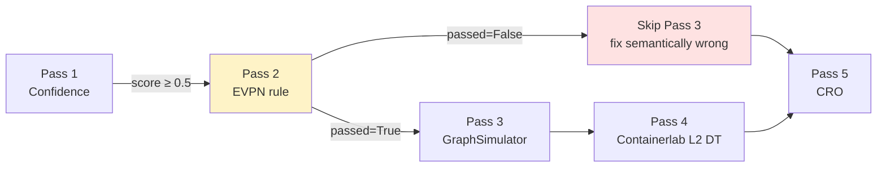

# EVPN fault-correctness rules

Pass 2 of the ValidateNode pipeline. Pure functions in [`agents/shared/validate_node.py::validate_fix_correctness`](https://github.com/eduardd76/dream_team_original/blob/main/agentic-netops-mvp/agents/shared/validate_node.py). 31 unit tests in `tests/test_evpn_fault_rules.py`.

## Why this gate exists

Before this gate: the LLM proposes a fix, the platform asks the digital twin "does it run?" If yes, ship. **Problem:** the LLM could propose a syntactically valid fix that addresses the wrong root cause, the wrong peer, or even the wrong protocol layer. The DT would happily simulate that, and the operator would approve based on misleading evidence.

Pass 2 catches it. Rule-based, cross-vendor, no LLM involvement in the decision.

## The 5 rules

### `evpn_peer_admin_shut`

The LLM proposes a fix because a BGP-EVPN peer was administratively shut.

**Pass criterion:** the fix must contain admin-shut recovery for the **same peer** named in `affected_component`.

- NX-OS / IOS-XE form: `no shutdown` after `neighbor <ip>`
- Arista EOS form: `no neighbor <ip> shutdown`
- SR Linux form: `admin-state enable` under the neighbor

**Wrong-peer detection:** if `affected_component` contains a dotted-quad IP, that IP must appear in the fix command string. Catches the LLM proposing a recovery for `10.0.0.5` when the syslog named `10.0.0.11`.

Live verified: 2026-05-30 on EC2. Card showed `passed=True, reason=fix_correct_evpn_peer_admin_shut`.

### `evpn_peer_down`

BGP-EVPN session down — but cause is multi-modal (underlay, MTU, hold timer, RT mismatch).

**Pass criterion (deliberately permissive):** the fix must touch any of:

- BGP session manipulation (`clear bgp`, `clear ip bgp`, reconfig of `neighbor <ip> remote-as`)
- Underlay route restoration (`ip route <vtep-ip>/32 ...`)
- MTU adjustment (`mtu 9216`)
- Hold timer adjustment (`hold-time`, `keepalive`)

Less strict than `admin_shut` because the legitimate fix space is wider.

### `evpn_vtep_unreachable`

VTEP unreachability — typically NVE source-interface down OR underlay loss to the remote VTEP loopback /32.

**Pass criterion:** the fix must touch one of:

- NVE source-interface (`no shutdown` on `nve1` / `Vxlan1` / `Loopback1`)
- NVE source-interface config (`source-interface loopback1`)
- Underlay /32 route restoration

### `evpn_vni_state`

VNI's EVI is inactive — RT mismatch, missing RD, or member-VNI config drift.

**Pass criterion:** the fix must touch:

- EVI/VNI config (`vni <N>`, `evpn`, `member vni <N>`)
- RT config (`route-target import`, `route-target export`, `rt-import`, `rt-export`)
- RD config

### `evpn_mac_inconsistency`

MAC mobility / flapping — same MAC appearing on multiple VTEPs with increasing `mobility_seq`.

**Pass criterion:** the fix must touch:

- MAC table clear (`clear mac-address dynamic`, `clear l2route evpn mac`)
- Loop prevention (BPDU guard, storm control)
- MAC-move thresholds (`port-security maximum-move`)

`post_check` explicitly notes: **the human reviewer should also investigate the host-side topology.** The platform fix is treating the symptom; the root cause may be a switching loop downstream.

## Cross-vendor matching

All rules match against:

- `commands_str = "; ".join(fix_commands).lower()`
- `affected_component.lower()`
- Common vendor keywords for the same operation (`no shutdown` / `no neighbor X shutdown` / `admin-state enable`)

If the LLM produces commands for a vendor that doesn't match the device's actual vendor, the rule still passes (the vendor translator in [`containerlab_manager.py`](https://github.com/eduardd76/dream_team_original/blob/main/agentic-netops-mvp/agents/shared/containerlab_manager.py) handles the translation later). The rule is checking semantic correctness, not vendor-specific syntax.

## Fail modes

Each rule returns one of:

- `passed=True, verified=True, reason="fix_correct_evpn_<name>"`
- `passed=False, verified=True, reason="fix_mismatch_evpn_<name> -- got: <first 100 chars>"`
- `passed=False, verified=True, reason="fix_wrong_peer -- expected <ip>"` (admin_shut only)
- `passed=False, verified=True, reason="fix_empty"` (empty command list)

`verified=True` is the important flag. Pass 2 is *semantically deciding* — not just "we don't know." The card shows the reviewer the reason in plain English.

## Integration with the other Passes



When Pass 2 fails, Pass 3 is **skipped** — wasting GraphSimulator cycles on a known-wrong fix is a bad trade. The CRO + BRF + PCV still run; they don't care if the fix is correct, they care about policy + blast radius + baseline. The human reviewer sees the full story.

## Tests

`tests/test_evpn_fault_rules.py`: **31 tests**, 0.06s runtime, no external dependencies.

Coverage:

- For each of the 5 rules: ALLOW path (fix matches) + FAIL path (fix doesn't match)
- Cross-vendor variants (NX-OS / EOS / SR Linux)
- Negative tests (OSPF fix on EVPN fault → rejected)
- Edge cases (empty fix, wrong peer IP, alias pattern_ids)
- Drift guard: `KNOWN_PATTERN_IDS` in `analyze_node.py` matches the rule names

## Live verification on EC2

```
[STEP 8] Fault correctness: passed=True, reason=fix_correct_evpn_peer_admin_shut
[STEP 8]   pre_check:  BGP-EVPN peer peer address 10.0.0.11 is administratively shut
[STEP 8]   post_check: Fix removes admin-shut on BGP-EVPN peer peer address 10.0.0.11
                       (NX-OS/IOS-XE syntax) -- session will re-establish
```

Captured 2026-05-30 on `<INSTANCE_ID>` via SSM.
