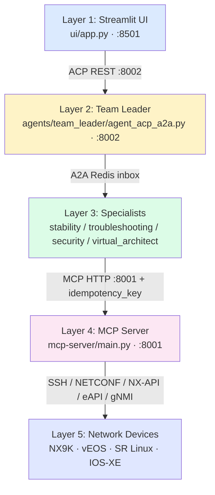

# For network engineers + SREs

The system, end-to-end, with citations. Every claim points at code or test files. Read in any order — the headings are independent.

## The 5-layer architecture in one diagram

**Critical architecture rules:**

1. Layer 3 agents NEVER SSH directly — all device I/O goes through MCP tools.
2. UI NEVER writes Redis directly — all human actions go through ACP.
3. All MCP calls require `idempotency_key` — 24h dedup cache in Redis.
4. Team Leader owns approval/history queues — specialists only use A2A inboxes.
5. Protocol assignment is fixed: Layer 1↔2 = ACP, Layer 2↔3 = A2A, Layer 3↔4 = MCP.

See [`agents/shared/acp_protocol.py`](https://github.com/eduardd76/dream_team_original/blob/main/agentic-netops-mvp/agents/shared/acp_protocol.py), [`a2a_protocol.py`](https://github.com/eduardd76/dream_team_original/blob/main/agentic-netops-mvp/agents/shared/a2a_protocol.py), [`mcp_client.py`](https://github.com/eduardd76/dream_team_original/blob/main/agentic-netops-mvp/agents/shared/mcp_client.py).

## What's here

| Topic | Read for |
|---|---|
| **[5-layer architecture](architecture.md)** | Full system design — sequence diagrams, queue map, file references. |
| **[7-pass validation pipeline](seven-pass-pipeline.md)** | The EVPN-native ValidateNode pipeline, pass by pass. |
| **[EVPN fault rules](fault-rules.md)** | The 5 EVPN fault-correctness rules + cross-vendor matching. |
| **[KG schema (Neo4j)](kg-schema.md)** | EVI / VTEP / BGPEVPNPeer / MACRoute / REACHABLE_VIA. |
| **[Test coverage](test-coverage.md)** | Dry-run E2E + unit suites + the determinism contract. |

## The Redis queue map

| Queue | Producer | Consumer |
|---|---|---|
| `incident_queue` | Syslog server | Team Leader |
| `a2a_stability_specialist_inbox` | Team Leader | Stability agent |
| `a2a_troubleshooting_specialist_inbox` | Team Leader | Troubleshooting agent |
| `a2a_security_specialist_inbox` | Team Leader | Security agent |
| `a2a_virtual_architect_inbox` | Team Leader | Virtual Architect (read-only) |
| `a2a_team_leader_inbox` | All specialists | Team Leader |
| `approval_queue` | Team Leader | UI (read-only display) |
| `approved_history` / `rejected_history` | Team Leader | UI (read-only) |

## Where to start

1. Read **[architecture.md](architecture.md)** for the big picture (~10 min).
2. Read **[seven-pass-pipeline.md](seven-pass-pipeline.md)** for the heart of the system (~15 min).
3. Skim **[test-coverage.md](test-coverage.md)** to understand the safety net (~5 min).
4. Pull the repo + `make docs-serve` to read this locally.
