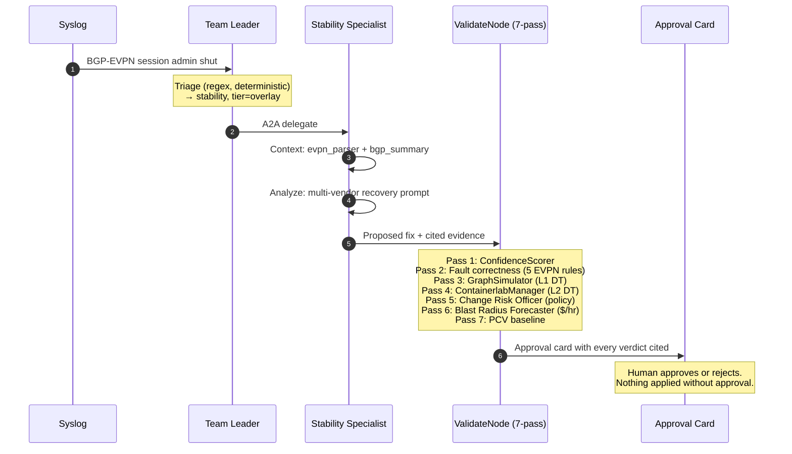

# Agentic NetOps

**Risk-managed autonomous network remediation.** Multi-vendor (Cisco NX-OS, Arista EOS, SR Linux, IOS-XE). Compliance-aware (PCI-DSS, SOX, HIPAA, FINRA, GDPR). Multi-tenant. Auditable.

The platform diagnoses, validates, and gates every proposed network change against your policies, your blast radius, and a digital twin — **before a human even sees the approval card**.

---

## Watch one incident, end to end

Every verdict on the card is **rule-cited, not LLM-judged**. That's what makes it sellable into PCI / SOX environments.

---

## Choose your entry point

-   :material-presentation-play:{ .lg .middle } **Workshop attendee / pilot prospect**

    ---

    5-minute one-pager. ROI math. What a 60-day pilot looks like.

    [:octicons-arrow-right-24: Pitch overview](pitch/index.md)

-   :material-server-network:{ .lg .middle } **Network engineer / SRE**

    ---

    The 7-pass pipeline, the 5 EVPN fault rules, the Knowledge Graph schema, the test coverage matrix.

    [:octicons-arrow-right-24: Engineering deep-dive](engineering/index.md)

-   :material-domain:{ .lg .middle } **Chief architect**

    ---

    The V3 persistent-shadow scalability story. Vendor abstraction. Cost analysis. The trade-offs we made deliberately.

    [:octicons-arrow-right-24: Architecture](architecture/index.md)

-   :material-source-branch:{ .lg .middle } **Future operator / onboarding**

    ---

    Codebase map. Local dev. EC2 + SSM deploy patterns. Common failure modes.

    [:octicons-arrow-right-24: Onboarding](onboarding/index.md)

---

## Where this is in 2026-05

- **Phase 3 closed:** all 7 ValidateNode passes producing cited evidence on live EC2.
- **5 EVPN fault-correctness rules** added to Pass 2 — verified live against `evpn_peer_admin_shut`.
- **`validate_evpn()` Phase 3 runtime** — deploy → apply → validate → teardown cycle, vendor-aware.
- **DT V3 RealVrNetlabBackend** implemented; ops/v3-host-setup.sh provisions the host.
- **99 unit tests** across the new surface, all green.
- **Workshop:** AutoCon5, 2026-06-09.

See [reference/workshop-status.md](reference/workshop-status.md) for the live readiness scorecard.

---

## Pilot inquiries

`dulharu.eduard@gmail.com`
