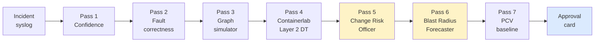

# What this is

A multi-agent platform that handles a network incident from raw syslog to human-approval card, with **four enterprise-grade safety gates** between the AI's proposed fix and the production fabric.

## The enterprise validation chain

Every approve/reject decision lands with:

### ⚖️ Change Risk Officer (CRO)

`ALLOW` / `MANUAL_REVIEW` / `BLOCK` verdict with **cited policies** (e.g. `business_hours_only`, `pci_dss_freeze`, `weekend_freeze`). Your operator's compliance officer can defend the verdict to an external auditor. Policies are customer-replaceable via `agents/change_risk_officer/policies.json` — your GRC team owns that file.

### 💥 Blast Radius Forecaster (BRF)

Business-impact translation. "VNI 10010 hosts `tenant1-payment-processing`; **$340K/hour SLA exposure**; **4,200 users** at risk; **PCI-DSS + SOX** compliance tags." Speaks CFO, not "8 devices."

### 🔬 DT Validation (Digital Twin)

- **Layer 1** — graph simulation (in-memory reachability + blast radius). Fast.
- **Layer 2** — containerlab. Real SR Linux + cEOS + FRR containers. The fix actually runs against a twin of the affected scope.
- **Layer 3** (production) — `DTTwinManager` persistent shadow with real vrnetlab images. See [Architecture → Scalability V3](../architecture/scalability-v3.md).

### 🔁 Post-change Verifier (PCV)

Baseline captured **pre-approval**; diff runs **post-apply**. Verdicts: `PASSED`, `REGRESSION_DETECTED`, `FIX_DID_NOT_TAKE`, `INDETERMINATE_PROBABLY_OK`. Closes the autonomous-remediation loop.

## Why this isn't another "AI for network ops" tool

| Other tools | This platform |
|---|---|
| LLM decides what change is safe | Rule-based gates decide — LLM only *proposes* |
| "Trust the model" | Every decision cited to a named policy, KG query, or rule |
| Vendor-specific | Multi-vendor by design — same pipeline for Cisco NX-OS, Arista EOS, SR Linux |
| Hand-tuned per customer | Topology-as-code (single YAML) drives the entire fabric model |
| Marketing-grade demos | Live evidence on EC2; 99 unit tests; deterministic regex triage |

## The 7-pass validation pipeline

Click [Engineering → 7-pass pipeline](../engineering/seven-pass-pipeline.md) for the deep technical walk.

## What sponsors at AutoCon5 will see live

A real incident — BGP-EVPN session admin-shut on `leaf-nx` — flowing through all 7 passes in ~90 seconds. The approval card lands in the UI at `http://<APP_HOST_IP>:8501` with every verdict cited. No magic. No "trust the AI." Every claim traceable to a row in a JSON file, a graph query, or a regex rule.
